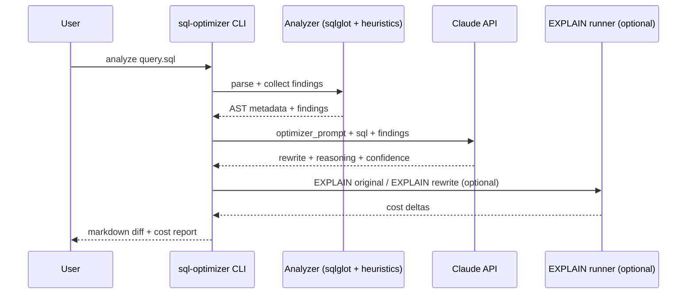

# AI-Assisted SQL Optimizer

A small CLI that uses Claude (via the Anthropic SDK) to suggest Spark SQL and
Snowflake query rewrites - partition pruning, broadcast joins, CTE
flattening, and friends. The tool is benchmarked against a 50-query corpus
with explicit ground truth, and runs in a heuristic-only `--dry-run` mode
when no API key is configured.

## Problem

There is a real gap between "junior writes a working query" and "senior
knows when to broadcast, partition-prune, flatten a CTE, or rewrite a
window function." The senior moves are usually idiomatic patterns
(broadcast small dims, push partition predicates to native columns,
collapse multi-scan CTEs into a single scan with `CASE`/`FILTER`) that
are easy to teach if a query is already in front of you. This tool
encodes those moves as heuristic findings and lets Claude propose
rewrites with the findings as structured context. It targets Spark SQL
and Snowflake, the dialects I work with most.

## How it works



Without `ANTHROPIC_API_KEY`, the CLI prints the heuristic findings only
and skips the API call.

## Setup

```bash
make install
make demo            # heuristic-only run over the 5 example queries
```

To enable the full Claude path:

```bash
cp .env.example .env
# add ANTHROPIC_API_KEY=sk-... to .env
sql-optimizer analyze corpus/queries/01_join_optimization.sql
```

CLI:

```bash
sql-optimizer --help
sql-optimizer analyze <file.sql> [--dry-run] [--dialect spark|snowflake]
sql-optimizer benchmark [--dry-run] [--limit 50]
```

## Methodology

Fifty queries across five categories: join_optimization,
aggregation_rewrite, cte_flattening, partition_pruning, broadcast_join.
Five are fully written; the rest are placeholders the maintainer fills
in over time.

Each ground-truth entry lists expected keywords (substrings the
suggestion should mention) and expected cost direction. The benchmark
prints per-category averages of keyword overlap and findings-hit rate.

See [`docs/methodology.md`](docs/methodology.md) for scoring detail and
the limitations of these proxies.

## Results

Numbers below are placeholders - run `make benchmark` (with or without
the API) and fill them in.

| Metric | Value |
| --- | --- |
| % suggestions accepted by human reviewer | [TODO: pct on sampled 10%] |
| Avg cost reduction (when EXPLAIN cost available) | [TODO: pct] |
| Human-rated quality (5-point Likert) | [TODO: avg] |
| Heuristic-only keyword overlap | [TODO: avg across corpus] |

## Limitations

- Claude can hallucinate column or table names that look plausible but
  do not exist in the schema. Always run the rewrite against a real
  EXPLAIN before shipping.
- EXPLAIN-based scoring is only as good as the optimizer's cost
  estimates - a "cheaper" plan can still be slower in practice.
- Dialect drift between Spark SQL and Snowflake catches edge cases
  (`QUALIFY`, lateral views, `FLATTEN(...)`).
- Prompt sensitivity: small changes to the prompt template materially
  change suggestion quality. The prompt is versioned at
  `src/sql_optimizer/prompts/optimizer_prompt.md`.
- Heuristic findings are deliberately simple - they catch the obvious
  cases but miss subtler ones (skewed joins, predicate pullup
  opportunities, etc).

## Tradeoffs

- **Heuristics + LLM vs LLM only.** Heuristics keep the dry-run mode
  honest and give Claude better context. They also let the tool
  function offline.
- **`sqlglot` vs raw regex.** `sqlglot` understands cross joins,
  windowed expressions, and Spark/Snowflake-specific syntax. Worth the
  dependency.
- **Typer vs Click.** Typer is thinner over Click and has the cleanest
  type-hint UX for one-off CLIs.

## What I would do differently in production

- Wrap the EXPLAIN runner so it can compare original vs rewritten plans
  against a real Spark / Snowflake instance.
- Add a learned scorer that fine-tunes per-team taste (some teams
  prefer many small CTEs for readability over one mega-statement).
- Cache prompt + response pairs by SQL fingerprint to keep API costs
  bounded.
- Promote `optimizer_prompt.md` to versioned, A/B-tested prompts with
  metrics per version.
