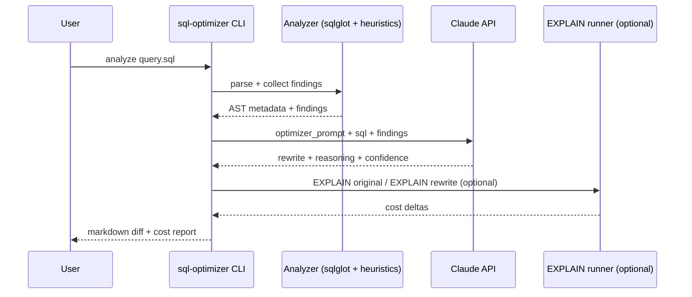
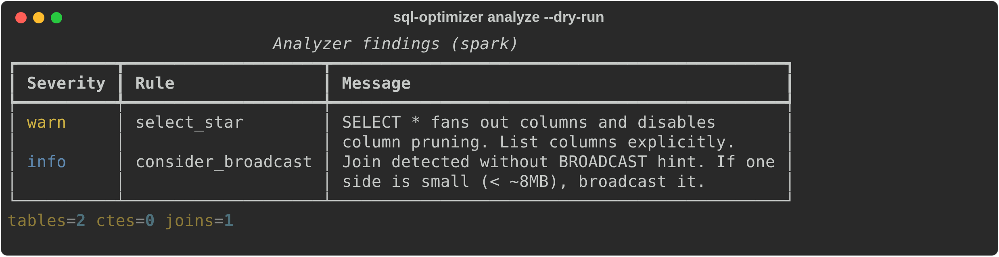
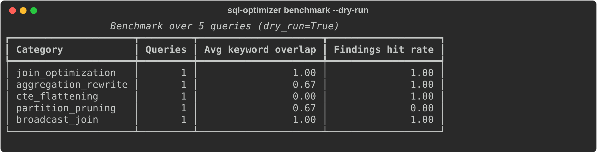

# AI-Assisted SQL Optimizer

[](https://github.com/AlexHuggler/Huggler-portfolio/actions/workflows/ci-ai-sql-optimizer.yml)


A small CLI that uses Claude (via the Anthropic SDK) to suggest Spark SQL and
Snowflake query rewrites - partition pruning, broadcast joins, CTE
flattening, and friends. The tool is benchmarked against a seeded
5-category corpus with explicit ground truth per query (designed to grow),
and runs in a heuristic-only `--dry-run` mode when no API key is configured.

## Problem

There is a real gap between "junior writes a working query" and "senior
knows when to broadcast, partition-prune, flatten a CTE, or rewrite a
window function." The senior moves are usually idiomatic patterns
(broadcast small dims, push partition predicates to native columns,
collapse multi-scan CTEs into a single scan with `CASE`/`FILTER`) that
are easy to teach if a query is already in front of you. This tool
encodes those moves as heuristic findings and lets Claude propose
rewrites with the findings as structured context. It targets Spark SQL
and Snowflake, the dialects I work with most.

## How it works


```mermaid
sequenceDiagram
  participant U as User
  participant CLI as sql-optimizer CLI
  participant A as Analyzer (sqlglot + heuristics)
  participant C as Claude API
  participant E as EXPLAIN runner (optional)

  U->>CLI: analyze query.sql
  CLI->>A: parse + collect findings
  A-->>CLI: AST metadata + findings
  CLI->>C: optimizer_prompt + sql + findings
  C-->>CLI: rewrite + reasoning + confidence
  CLI->>E: EXPLAIN original / EXPLAIN rewrite (optional)
  E-->>CLI: cost deltas
  CLI-->>U: markdown diff + cost report
```

Without `ANTHROPIC_API_KEY`, the CLI prints the heuristic findings only
and skips the API call:



## Setup

```bash
make install
make demo            # heuristic-only run over the 5 example queries
```

To enable the full Claude path:

```bash
cp .env.example .env
# add ANTHROPIC_API_KEY=sk-... to .env
sql-optimizer analyze corpus/queries/01_join_optimization.sql
```

CLI:

```bash
sql-optimizer --help
sql-optimizer analyze <file.sql> [--dry-run] [--dialect spark|snowflake]
sql-optimizer benchmark [--dry-run] [--limit 50]
```

## Methodology

Five categories, one fully specified query per category:
join_optimization, aggregation_rewrite, cte_flattening,
partition_pruning, broadcast_join. Every query has an explicit
ground-truth entry, and the corpus is designed to grow - adding a query
is one `.sql` file plus one ground-truth entry.

Each ground-truth entry lists expected keywords (substrings the
suggestion should mention) and expected cost direction. The benchmark
prints per-category averages of keyword overlap and findings-hit rate.

See [`docs/methodology.md`](docs/methodology.md) for scoring detail and
the limitations of these proxies.

## Results

Measured with `make benchmark` in heuristic-only `--dry-run` mode (no
API key), seeded 5-category corpus, Linux container, 2026-07. Reproduce
with one command.

| Metric | Measured |
| --- | --- |
| Avg keyword overlap vs ground truth (heuristics only) | 0.67 across 5 queries |
| Findings hit rate (>= 1 correct finding per query) | 4 of 5 queries (0.80) |
| Benchmark wall clock | 0.34 s for the corpus (~68 ms per query) |
| Unit tests | 18 passed |



The cte_flattening query scores 0.00 on keyword overlap in dry-run mode:
its rewrite vocabulary ("single scan", "CASE") only appears once Claude
proposes the rewrite - the heuristics alone flag the multi-scan pattern
but do not name the fix. That gap is exactly what the LLM adds.

### Planned evaluation (needs an engine and/or reviewers - not run here)

| Metric | Status |
| --- | --- |
| % suggestions accepted by human reviewer | not measured (needs sampled human review) |
| Avg cost reduction via EXPLAIN | not measured (needs a live Spark/Snowflake engine) |
| Human-rated quality (5-point Likert) | not measured |

## Limitations

- Claude can hallucinate column or table names that look plausible but
  do not exist in the schema. Always run the rewrite against a real
  EXPLAIN before shipping.
- EXPLAIN-based scoring is only as good as the optimizer's cost
  estimates - a "cheaper" plan can still be slower in practice.
- Dialect drift between Spark SQL and Snowflake catches edge cases
  (`QUALIFY`, lateral views, `FLATTEN(...)`).
- Prompt sensitivity: small changes to the prompt template materially
  change suggestion quality. The prompt is versioned at
  `src/sql_optimizer/prompts/optimizer_prompt.md`.
- Heuristic findings are deliberately simple - they catch the obvious
  cases but miss subtler ones (skewed joins, predicate pullup
  opportunities, etc).

## Tradeoffs

- **Heuristics + LLM vs LLM only.** Heuristics keep the dry-run mode
  honest and give Claude better context. They also let the tool
  function offline.
- **`sqlglot` vs raw regex.** `sqlglot` understands cross joins,
  windowed expressions, and Spark/Snowflake-specific syntax. Worth the
  dependency.
- **Typer vs Click.** Typer is thinner over Click and has the cleanest
  type-hint UX for one-off CLIs.

## What I would do differently in production

- Wrap the EXPLAIN runner so it can compare original vs rewritten plans
  against a real Spark / Snowflake instance.
- Add a learned scorer that fine-tunes per-team taste (some teams
  prefer many small CTEs for readability over one mega-statement).
- Cache prompt + response pairs by SQL fingerprint to keep API costs
  bounded.
- Promote `optimizer_prompt.md` to versioned, A/B-tested prompts with
  metrics per version.
