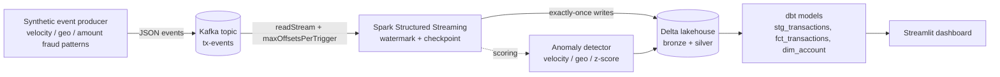

# Real-Time Fraud Signals Pipeline

Production-shaped streaming fraud-detection pipeline:
**Kafka -> Spark Structured Streaming -> Delta -> dbt -> Streamlit**.
A recruiter can clone, run `make demo`, and see meaningful output in under
five minutes without Kafka, Spark, or any cloud account.

## Problem

Fraud teams in telecom and fintech need to react in seconds, not hours.
Batch ETL surfaces compromised accounts long after the damage is done -
chargebacks, regulatory exposure, customer churn. A streaming
fraud-signals pipeline ingests transaction events from upstream payment
systems, applies rules and statistical anomaly detection (velocity bursts,
impossible-travel, amount Z-score), and writes scored events to a
lakehouse where analysts can slice further with dbt. Streaming over batch
is the right call when **latency-to-detection** is itself a business
metric and when human reviewers benefit from richly-labeled near-real-time
events. This project demonstrates the production patterns that matter:
exactly-once semantics, watermark-based late-event handling, dbt tests on
the resulting marts, and a lightweight dashboard for ops.

## Architecture



Key callouts:

- `checkpointLocation` is configured per stream so restarts resume from the
  last committed Kafka offsets.
- `withWatermark("ts", "2 minutes")` bounds state and tolerates clock skew.
- The Delta sink is idempotent, which combined with the checkpoint gives
  end-to-end exactly-once.

## Stack

| Tool | Why this one |
| --- | --- |
| Apache Kafka | Replayable, ordered per partition, decouples producer from consumer |
| Spark Structured Streaming | Mature exactly-once with checkpoints, broad ecosystem support |
| Delta Lake | ACID lakehouse on cheap object storage, fast incremental reads, built-in MERGE |
| dbt | Testable, reviewable SQL with explicit lineage; works with duckdb (local) and Databricks (prod) |
| Streamlit | Single-file operator UI, no JS build step |
| uv + ruff + pytest | Fast, reproducible Python toolchain |

## Setup

```bash
# 1. Install the demo deps (no Spark/Kafka needed)
make install

# 2. Run the demo path - generates events + scores anomalies
make demo
```

For the full streaming experience:

```bash
# Install streaming + dashboard extras
make install-streaming

# Start Kafka + Zookeeper + Spark master
docker compose up -d

# In separate terminals:
make run-producer      # writes synthetic events to Kafka
make run-stream        # Spark Structured Streaming -> Delta
make run-dashboard     # Streamlit on http://localhost:8501
```

For the analytics layer:

```bash
cp dbt_fraud/profiles.yml.example ~/.dbt/profiles.yml  # edit if needed
cd dbt_fraud && dbt deps && dbt build
```

## Results

Numbers below are placeholders - run the pipeline locally or against a
managed cluster to fill in your own measurements.

| Metric | Value |
| --- | --- |
| Throughput sustained | [TODO: events/sec on 4-core local Spark] |
| End-to-end latency p50 / p95 / p99 | [TODO: ms producer-write to Delta-visible] |
| Anomaly precision (synthetic ground truth) | [TODO: precision] |
| Anomaly recall (synthetic ground truth) | [TODO: recall] |
| Restart-from-checkpoint loss | [TODO: events lost / duplicated across N restarts] |

## Tradeoffs

- **Spark Structured Streaming vs Flink.** Flink has lower latency and
  better state primitives, but Spark wins on talent availability,
  Databricks integration, and unified batch+streaming SQL. For
  per-second to sub-minute latency with team-wide PySpark fluency, Spark
  is the safer pick.
- **Delta vs Iceberg.** Delta has the better streaming MERGE story today
  (Databricks-native, auto-compact). Iceberg has the better engine
  portability and partition evolution. This project picks Delta because
  the streaming workflow benefits more from the former.
- **Exactly-once vs at-least-once.** Exactly-once costs you per-batch
  latency from the commit protocol and disk for the checkpoint. For a
  fraud signal where a duplicate scored event is operationally annoying
  but not data-loss, exactly-once is worth it.
- **Batch vs streaming.** A daily batch over the same Delta table would
  be cheaper and simpler. Streaming is justified by minutes-level SLAs
  on detection.

## What I would do differently in production

- Move anomaly detection to a feature store (Feast or a Databricks
  Feature Store) with versioned features and online lookup.
- Replace the Z-score on each micro-batch with online algorithms
  (Welford's, t-digest) so per-account memory is bounded.
- Add a schema registry (Confluent or AWS Glue) so producer/consumer
  compatibility is enforced at deploy time.
- Replace the Streamlit ops UI with a role-aware web app for non-eng
  consumers.
- Wire alerts on the Delta `_delta_log/_change_data_feed` so downstream
  rule changes don't silently drift.

## Limitations

- The synthetic generator embeds fraud patterns by design - real-world
  fraud is rarer and noisier, so anomaly precision/recall here is an
  upper bound on a honest pipeline's performance.
- The streaming consumer assumes one Kafka partition per producer
  account-id key for ordering; multi-partition keys would require
  re-keying or a stateful join.
- The dbt project is configured for duckdb locally; the Databricks
  profile is provided as an example but not exercised here.
- No PII synthetic data: account_ids are UUIDs, no real names/emails.

See [`docs/architecture.md`](docs/architecture.md) for deeper detail on
checkpoints, watermarks, and the exactly-once contract.
