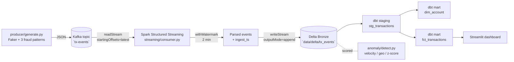

# Architecture

Detailed view of the streaming fraud-signals pipeline. The headline diagram
lives in the README; this doc adds the moving parts a reviewer needs to see.

## End-to-end data flow

## Exactly-once semantics

Spark Structured Streaming writes are exactly-once when the sink is
idempotent (Delta is) and the same `checkpointLocation` is reused across
restarts. The checkpoint stores:

* the last committed offsets per Kafka partition,
* the in-flight micro-batch metadata,
* the WAL of pending state operations.

A failed micro-batch is replayed from the same offsets, and Delta's commit
protocol prevents partial writes from being visible.

## Watermark and late events

`withWatermark("ts", "2 minutes")` lets the engine drop state for events
older than 2 minutes past the latest seen timestamp. Adjust based on
producer clock skew and acceptable late-event drop rate.

## Local dev vs production

| Concern | Local | Production |
| --- | --- | --- |
| Kafka | docker-compose Bitnami images | Confluent Cloud / MSK |
| Storage | Local Delta on disk | ADLS Gen2 / S3 with Delta |
| Compute | `pyspark` standalone | Databricks Job / EMR |
| Orchestration | `make run-stream` | Databricks Workflow / Airflow |
| Monitoring | stderr | Datadog / Spark UI / Delta history |

## Why Delta (and not Iceberg here)

Delta Lake's tight integration with Databricks' `MERGE INTO` and
auto-compaction make it the safer default for a streaming workload that
writes small files at second-scale cadence. Iceberg's hidden partitioning
shines for batch analytics; for true streaming MERGE upserts on slowly
changing accounts, Delta is the more pragmatic pick today.
