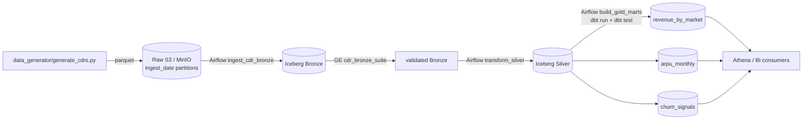

# Telecom Billing Lakehouse

End-to-end Medallion lakehouse for synthetic CDR (Call Detail Record) data:
**generator -> MinIO/S3 -> Airflow -> Bronze -> Silver -> dbt Gold marts**.
Runs locally on docker-compose; an optional Terraform stack provisions the
AWS variant.

## Problem

Telecom billing teams handle hundreds of millions of events per day -
voice calls, SMS, and data sessions - across many markets and plans. The
business needs are conflicting: ops needs near-real-time revenue
visibility, FP&A wants stable monthly mart freshness, finance requires
auditable late-arriving corrections, and BI consumers want a
reasonable-shape star schema. A traditional warehouse forces every
correction to be a heavyweight rewrite. The Medallion lakehouse pattern
(Bronze raw -> Silver normalized -> Gold dimensional, all Iceberg over
object storage) handles the conflict by treating each layer as
write-optimised for its own job, with explicit data contracts at the
boundary. This project demonstrates the pattern end-to-end with all the
moving parts you'd expect in production: Airflow orchestration,
Great-Expectations data contracts at Bronze, dbt for Silver/Gold with
tests, and a Terraform deployment to AWS.

## Architecture



## Stack

| Tool | Why this one |
| --- | --- |
| Apache Airflow (LocalExecutor) | Mature DAG model, retries, SLAs, task-level logs |
| Apache Iceberg | Partition evolution, hidden partitioning, engine-portable |
| MinIO (local) / S3 (prod) | Same API, cheap object storage |
| Great Expectations | Bronze-layer column contracts that block Silver on failure |
| dbt | Testable SQL with `unique` / `not_null` / `accepted_values` / `relationships` |
| Terraform | Reproducible AWS provisioning (S3 + Glue catalog) |
| dbt-duckdb (local) / dbt-athena (AWS) | Same models, two engines |

## Setup

```bash
# 1. Install demo deps (no Airflow needed)
make install

# 2. Run the local demo - generator + Bronze + Silver + Gold via DuckDB
make demo
```

For the full Airflow + MinIO experience:

```bash
# Bring up Airflow + Postgres + MinIO
make airflow-up

# UI:    http://localhost:8080  (admin / admin)
# MinIO: http://localhost:9001  (minio / minio12345)

# Trigger DAGs from the UI or via CLI:
docker compose exec airflow-scheduler airflow dags trigger ingest_cdr_bronze
```

For the analytics layer:

```bash
cp dbt_telecom/profiles.yml.example ~/.dbt/profiles.yml
cd dbt_telecom && dbt deps && dbt build
```

For the AWS deployment, see [`terraform/README.md`](terraform/README.md).

## Data quality strategy

- **Bronze** is the contract layer. The Great Expectations suite
  `cdr_bronze_suite` enforces column types, nulls, ranges, and a regex
  on `caller_msisdn`. Failures fail the Airflow task and block Silver.
- **Silver** is the modeled layer. dbt tests on every model with
  `unique`, `not_null`, `accepted_values`, and expression checks
  (`>= 0`, etc).
- **Gold** is the consumption layer. dbt `relationships` tests assert
  referential integrity between marts and Silver.

### Sample data contract

The Bronze contract lives in
[`great_expectations/expectations/cdr_bronze_suite.json`](great_expectations/expectations/cdr_bronze_suite.json).
A representative excerpt:

```json
{
  "expectation_type": "expect_column_values_to_match_regex",
  "kwargs": { "column": "caller_msisdn", "regex": "^\\+1[0-9]{10}$" }
}
```

## Results

Numbers below are placeholders - run the pipeline locally and fill them
in with your own measurements.

| Metric | Value |
| --- | --- |
| Bronze ingest rate | [TODO: rows/sec on your laptop] |
| GE pass rate after first run | [TODO: pct] |
| Gold mart freshness SLA | [TODO: minutes from raw->gold] |
| dbt test count (silver+gold) | [TODO: count] |
| Storage compression ratio | [TODO: parquet vs csv] |

## Tradeoffs

- **Iceberg vs Delta.** Iceberg wins for engine portability (Spark,
  Trino, Athena, Snowflake all read it) and partition evolution. Delta
  wins for streaming MERGE in Databricks. For a batch-first telecom
  billing workload, Iceberg's the cleaner fit.
- **Airflow vs Dagster.** Dagster has nicer asset-graph semantics and
  better local dev, but Airflow has the talent pool and the
  battle-tested operators. For a portfolio piece showing breadth,
  Airflow is the more useful demonstration.
- **MinIO vs LocalStack.** MinIO is honest about being S3-compatible
  storage, which is what we need; LocalStack is broader but
  overshoots.
- **Great Expectations vs dbt tests only.** GE catches schema drift at
  the contract boundary; dbt tests catch model-level invariants. Both
  layers are needed.

## What I would do differently in production

- Replace the GE 0.18 API with Great Expectations 1.x (or `pandera`)
  once a stable migration path lands.
- Add lineage via OpenLineage emitters on every Airflow task and dbt
  run.
- Add `expect_column_pair_values_to_be_equal` style cross-column
  contracts (e.g. roaming flag must match a roaming-eligible plan).
- Replace LocalExecutor with KubernetesExecutor for scale-out.
- Add an Iceberg compaction DAG to keep the Bronze partition file count
  bounded.

## Limitations

- Synthetic data: phone numbers are random `+1NNNNNNNNNN`, no real PII.
- The local demo uses DuckDB instead of a true Iceberg engine - the
  data contract is the same but partition pruning is approximated.
- Terraform doesn't provision IAM, KMS, or VPC - too
  environment-specific to template.
- `airflow dags list` requires Airflow installed; the ingestion code
  itself does not.

See [`docs/architecture.md`](docs/architecture.md) for deeper detail.
