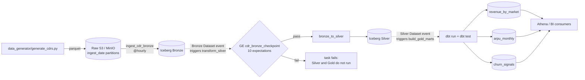
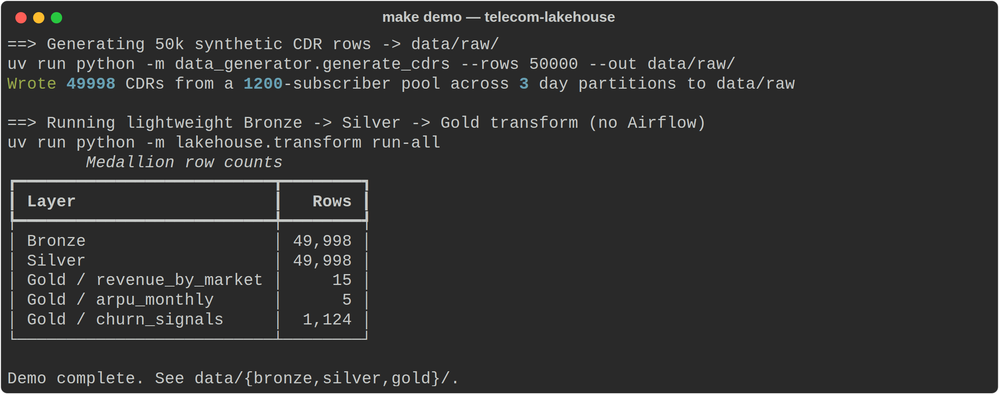
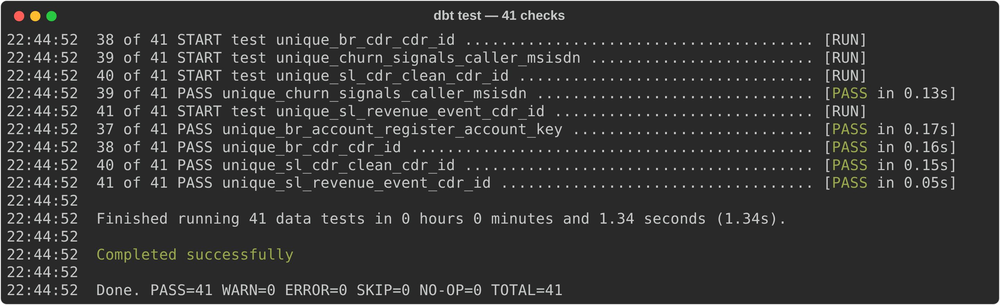

# Telecom Billing Lakehouse

[](https://github.com/AlexHuggler/Huggler-portfolio/actions/workflows/ci-telecom-lakehouse.yml)


End-to-end Medallion lakehouse for synthetic CDR (Call Detail Record) data:
**generator -> MinIO/S3 -> Airflow -> Bronze -> Silver -> dbt Gold marts**.
Runs locally on docker-compose; an optional Terraform stack provisions the
AWS variant.

## Problem

Telecom billing teams handle hundreds of millions of events per day -
voice calls, SMS, and data sessions - across many markets and plans. The
business needs are conflicting: ops needs near-real-time revenue
visibility, FP&A wants stable monthly mart freshness, finance requires
auditable late-arriving corrections, and BI consumers want a
reasonable-shape star schema. A traditional warehouse forces every
correction to be a heavyweight rewrite. The Medallion lakehouse pattern
(Bronze raw -> Silver normalized -> Gold dimensional, all Iceberg over
object storage) handles the conflict by treating each layer as
write-optimised for its own job, with explicit data contracts at the
boundary. This project demonstrates the pattern end-to-end with all the
moving parts you'd expect in production: Airflow orchestration,
Great-Expectations data contracts at Bronze, dbt for Silver/Gold with
tests, and a Terraform deployment to AWS.

## Architecture


```mermaid
flowchart LR
  G[data_generator/generate_cdrs.py] -->|parquet| R[(Raw S3 / MinIO<br/>ingest_date partitions)]
  R -->|"ingest_cdr_bronze<br/>@hourly"| BR[(Iceberg Bronze)]
  BR -.->|"Bronze Dataset event<br/>triggers transform_silver"| GE{"GE cdr_bronze_checkpoint<br/>10 expectations"}
  GE -- pass --> T[bronze_to_silver]
  GE -- fail --> X["task fails:<br/>Silver and Gold do not run"]
  T --> SI[(Iceberg Silver)]
  SI -.->|"Silver Dataset event<br/>triggers build_gold_marts"| D[dbt run + dbt test]
  D --> GO1[(revenue_by_market)]
  D --> GO2[(arpu_monthly)]
  D --> GO3[(churn_signals)]
  GO1 --> BI[Athena / BI consumers]
  GO2 --> BI
  GO3 --> BI
```

### Orchestration

The three DAGs are linked with [Airflow Datasets](https://airflow.apache.org/docs/apache-airflow/2.9.3/authoring-and-scheduling/datasets.html)
(data-aware scheduling, Airflow 2.4+), defined once in
[`dags/lakehouse_datasets.py`](dags/lakehouse_datasets.py). Only Bronze ingest runs on a clock:

| DAG | Runs when | On success, emits |
| --- | --- | --- |
| `ingest_cdr_bronze` | `@hourly` | Bronze Dataset (`data/bronze/cdr.parquet`) |
| `transform_silver` | the Bronze Dataset is updated | Silver Dataset (`data/silver/cdr.parquet`), only if the contract passes |
| `build_gold_marts` | the Silver Dataset is updated | Gold marts (dbt) |

Silver can't run ahead of Bronze, and Gold rebuilds after each Silver landing
(hourly in practice) instead of on its own daily clock. Each DAG rewrites a single
file, so all three run with `max_active_runs=1`. The wiring is asserted by
[`tests/test_dag_integrity.py`](tests/test_dag_integrity.py), which CI runs with
Airflow installed.

`build_gold_marts` runs `dbt run` then `dbt test` over the whole dbt project, as
`make dbt-run` / `make dbt-test` do: the Bronze views over `data/raw`, then the
Silver tables, then the Gold marts. The Silver Dataset triggers the run but isn't
dbt's input. dbt's `sl_cdr_clean` mirrors `bronze_to_silver`, and in the compose
run under Results it held the same 49,998 `cdr_id`s as `data/silver/cdr.parquet`.

## Stack

| Tool | Why this one |
| --- | --- |
| Apache Airflow (LocalExecutor) | Mature DAG model, retries, SLAs, task-level logs, Dataset-driven scheduling |
| Apache Iceberg | Partition evolution, hidden partitioning, engine-portable |
| MinIO (local) / S3 (prod) | Same API, cheap object storage |
| Great Expectations | Bronze-layer column contracts that block Silver on failure |
| dbt | Testable SQL with `unique` / `not_null` / `accepted_values` / `relationships` |
| Terraform | Reproducible AWS provisioning (S3 + Glue catalog) |
| dbt-duckdb (local) / dbt-athena (AWS) | Same models, two engines |

## Setup

```bash
# 1. Install demo deps (no Airflow needed)
make install

# 2. Run the local demo - generator + Bronze + Silver + Gold via DuckDB
make demo
```



For the full Airflow + MinIO experience (after `make demo`, which writes the
`data/raw` the ingest DAG reads):

```bash
# Linux only: let the containers write ./data and great_expectations/uncommitted
echo "AIRFLOW_UID=$(id -u)" >> .env

# Build the Airflow image (first run) and bring up Airflow + Postgres + MinIO
make airflow-up

# UI:    http://localhost:8080  (admin / admin)
# MinIO: http://localhost:9001  (minio / minio12345)

# Trigger DAGs from the UI or via CLI:
docker compose exec airflow-scheduler airflow dags trigger ingest_cdr_bronze
```

`make airflow-up` builds a local image from
[`docker/airflow/Dockerfile`](docker/airflow/Dockerfile): `apache/airflow:2.9.3`
plus the DAGs' Python dependencies, installed against Airflow's constraints file
so no package the image ships changes. dbt-core and dbt-duckdb go into a separate
virtualenv, because dbt-core 1.11 needs `protobuf>=6` and the image pins
`opentelemetry-proto` 1.25.0, which needs `protobuf<5`. The image also carries the
compose dbt profile, which writes `data/telecom.duckdb`.

To run the Bronze data contract (the same GE checkpoint the DAG runs) over the
demo's Bronze output:

```bash
make install-quality   # adds great-expectations 0.18
make contract          # exits non-zero if any expectation fails
```

For the analytics layer (fully offline - the project vendors local
replacements for its two dbt_utils macros, so there is no `dbt deps` step):

```bash
make demo   # produces data/raw the dbt sources read
cp dbt_telecom/profiles.yml.example dbt_telecom/profiles.yml
make dbt-run && make dbt-test
```

For the AWS deployment, see [`terraform/README.md`](terraform/README.md).

## Data quality strategy

- **Bronze** is the contract layer. The Great Expectations suite
  `cdr_bronze_suite` (10 expectations) specifies the column set, nulls,
  uniqueness, accepted values, ranges, and a regex on `caller_msisdn`.
  `transform_silver` runs it through the `cdr_bronze_checkpoint`
  ([`src/lakehouse/contract.py`](src/lakehouse/contract.py)) before
  `bronze_to_silver`. Any failed expectation raises `DataContractError`
  and fails the task, without retries, since a contract failure is
  deterministic. `bronze_to_silver` is then `upstream_failed`, no Silver
  Dataset event fires, and Gold does not run. Enforcement is the default.
  If `great_expectations` is not installed the task fails rather than
  skipping, and the only bypass is `LAKEHOUSE_ENFORCE_CONTRACT=false`,
  which logs a warning on every run.
- **Silver** is the modeled layer. dbt tests on every model with
  `unique`, `not_null`, `accepted_values`, and expression checks
  (`>= 0`, etc).
- **Gold** is the consumption layer. dbt `relationships` tests assert
  referential integrity between marts and Silver.

### Sample data contract

The Bronze contract lives in
[`great_expectations/expectations/cdr_bronze_suite.json`](great_expectations/expectations/cdr_bronze_suite.json).
A representative excerpt:

```json
{
  "expectation_type": "expect_column_values_to_match_regex",
  "kwargs": { "column": "caller_msisdn", "regex": "^\\+1[0-9]{10}$" }
}
```

## Results

Measured on the no-infra demo path (`make demo`, `make contract`,
`make dbt-run`, `make dbt-test`; DuckDB engine, seed 42, 49,998 CDR rows
across 3 day partitions), single process in a Linux container. Transform
and dbt rows are from 2026-07. The contract, orchestration and unit-test
rows are from 2026-10, on a 4-vCPU container, with Airflow 2.9.3 in
docker-compose for the two orchestration rows. Reproduce with the
commands above.

| Metric | Measured |
| --- | --- |
| Raw -> Bronze -> Silver -> Gold transform | 49,998 rows in 0.53 s (~94k rows/sec, single process) |
| End-to-end demo (generate + transform) | 2.8 s wall clock |
| dbt build | 8 models (bronze views, silver + gold tables), all built |
| dbt tests | 41 of 41 passing (unique, not_null, accepted_values, relationships, expression checks) |
| Bronze data contract | 10 of 10 expectations pass over 49,998 Bronze rows (`make contract`, GE 0.18.22): 3.8-4.0 s warm, 6.4-7.4 s on a cold first run, including the GE import |
| Contract enforcement | One injected raw row with `market = 'MARS'` failed `great_expectations_bronze` with `DataContractError` (1 of 10 expectations); `bronze_to_silver` went `upstream_failed`, Silver was not rewritten, and `build_gold_marts` got no run (docker-compose) |
| DAG linkage | One `ingest_cdr_bronze` run led to a `dataset_triggered` run of `transform_silver`, then one of `build_gold_marts`, all three `success` (docker-compose). Its dbt tasks (dbt-core 1.11.15) built 8 models and passed 41 of 41 tests. 10 DAG-integrity tests assert the wiring in CI |
| Unit tests | 29 passed with the `airflow` + `quality` extras (Airflow 2.11.2, GE 0.18.22); 15 passed on the base install, where the DAG-integrity and real-checkpoint tests skip |



Raw synthetic CDRs land as Parquet already, so there is no CSV-to-Parquet
compression ratio to report on the local path; on the AWS path the same
claim depends on the upstream feed format.

## Tradeoffs

- **Iceberg vs Delta.** Iceberg wins for engine portability (Spark,
  Trino, Athena, Snowflake all read it) and partition evolution. Delta
  wins for streaming MERGE in Databricks. For a batch-first telecom
  billing workload, Iceberg's the cleaner fit.
- **Airflow vs Dagster.** Dagster has nicer asset-graph semantics and
  better local dev, but Airflow has the talent pool and the
  battle-tested operators. For a portfolio piece showing breadth,
  Airflow is the more useful demonstration.
- **MinIO vs LocalStack.** MinIO is honest about being S3-compatible
  storage, which is what we need; LocalStack is broader but
  overshoots.
- **Great Expectations vs dbt tests only.** GE catches schema drift at
  the contract boundary; dbt tests catch model-level invariants. Both
  layers are needed.

## What I would do differently in production

- Replace the GE 0.18 API with Great Expectations 1.x (or `pandera`)
  once a stable migration path lands.
- Quarantine contract-failing rows and alert, instead of failing the
  whole batch. Today any violation blocks that run's Silver and Gold.
- Point the Datasets at the S3 / Iceberg table URIs on the AWS path; they
  currently name the local files the DuckDB transforms write.
- Point dbt's sources at the contract-validated Silver output instead of
  re-deriving Bronze and Silver from `data/raw`, so Gold is built from exactly
  what the Silver Dataset event announced.
- Add lineage via OpenLineage emitters on every Airflow task and dbt
  run.
- Add `expect_column_pair_values_to_be_equal` style cross-column
  contracts (e.g. roaming flag must match a roaming-eligible plan).
- Replace LocalExecutor with KubernetesExecutor for scale-out.
- Add an Iceberg compaction DAG to keep the Bronze partition file count
  bounded.

## Limitations

- Synthetic data: phone numbers are random `+1NNNNNNNNNN`, no real PII.
- The local demo uses DuckDB instead of a true Iceberg engine - the
  data contract is the same but partition pruning is approximated.
- Terraform doesn't provision IAM, KMS, or VPC - too
  environment-specific to template.
- `airflow dags list` requires Airflow installed; the ingestion code
  itself does not.

See [`docs/architecture.md`](docs/architecture.md) for deeper detail.
