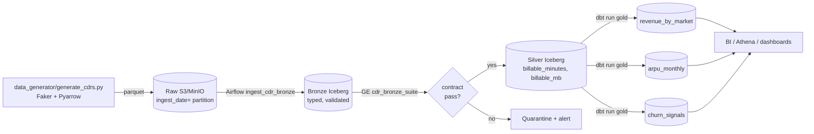

# Architecture

End-to-end view of the telecom Medallion lakehouse. The headline diagram is
in the README; this doc fills in the parts a reviewer asks about second.

## Layers

## Data quality strategy

| Layer | Tool | Tests |
| --- | --- | --- |
| Raw | None | Parquet schema enforced by writer |
| Bronze | Great Expectations | Column types, nulls, ranges, regex on `caller_msisdn` |
| Silver | dbt | `unique`, `not_null`, `accepted_values`, expression checks |
| Gold | dbt | Same set, plus `relationships` between marts |

## Data contract example

The `cdr_bronze_suite` (in `great_expectations/expectations/`) requires:

- All columns present in a fixed set.
- `cdr_id` non-null and unique.
- `caller_msisdn` non-null and matches `^\+1[0-9]{10}$`.
- `call_type` in `{VOICE, SMS, DATA}`.
- `market` in `{NORTH, SOUTH, EAST, WEST, CENTRAL}`.
- `duration_sec` between 0 and 86400.

A failed expectation fails the Airflow task, which blocks the Silver build.

## Local vs production

| Concern | Local docker-compose | AWS production |
| --- | --- | --- |
| Object storage | MinIO | S3 (encrypted, versioned) |
| Catalog | duckdb file | Glue Data Catalog |
| Compute | Python + duckdb | EMR / Glue / Databricks |
| Query | duckdb / `dbt-duckdb` | Athena / `dbt-athena` |
| Orchestration | LocalExecutor Airflow | MWAA |

## Why Iceberg

Hidden partitioning means a `WHERE ingest_date = '2026-01-01'` predicate
prunes correctly even after the partition spec evolves, which Hive-style
catalogs can't promise. Iceberg's metadata-level `MERGE` and
schema-evolution rules make billing corrections (the dominant write
pattern in telecom) tractable without rewriting old partitions.
